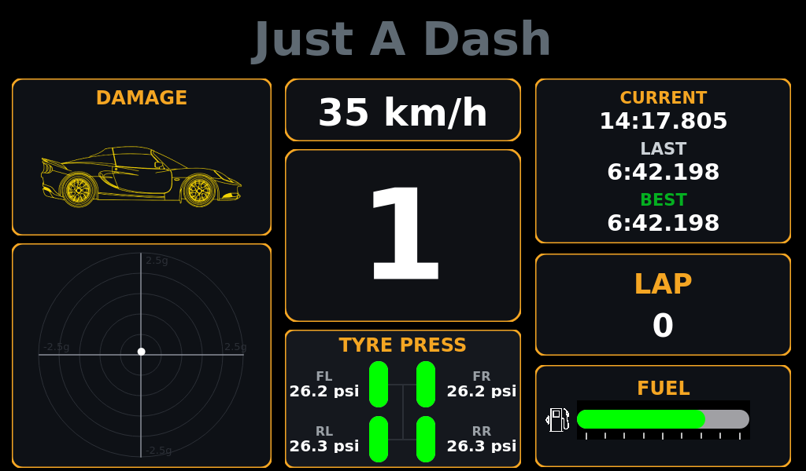

# JAD — Just A Dash

A lightweight, **1024×600** Qt dashboard for a Raspberry Pi 5 that renders gauges/text/images, reads live telemetry from Assetto Corsa (via UDP), and supports GPIO buttons + shift lights.



---

## Features (quick)

* **Elements** (absolute positioning, no layout manager)

  * `round_gauge`, `linear_gauge` (horizontal/vertical), `text`, `readout`
  * `image` (PNG/JPG/SVG), `image_gauge` (tinted by value with dark/alpha masking)
  * `geometry` (rect/round\_rect/circle/line/ring/arc), `gear`, `gg` (G-G diagram)
  * `group` (move children together)
* **JSON pages** in `pages/` (hot-reload on file change; page background color)
* **Visibility rules**: `visible_when` with optional `latch`
* **Channels system** with transforms:

  * `scale`, `offset`, `clamp`, `ema` smoothing, and `ratio_to` (derived channels)
* **Input / Hardware**

  * **Buttons** (libgpiod v2): debounced, signals + channels

    * per button: `btn_<name>_pressed`, `btn_<name>_click`, `btn_<name>_click_ts`, `btn_<name>_toggle`
    * default names: `next, prev, A, B`
  * **Shift lights** (10 GPIOs): bar/dot, thresholds, **flash all** above threshold
* **Assetto Corsa** telemetry (Windows sender → Pi UDP receiver)

  * physics: rpm, gear, gas/brake, fuel (L), speed, tyre wear & pressure, etc.
  * graphics: lap times (current/last/best), laps completed/total, **lap progress** (0..1)
  * static: max rpm, fuel tank capacity
* **GG diagram**: capped trail (deque `maxlen`), optional sample throttle, button-reset
* **Boot/startup**: desktop autostart or systemd (user service)
* **Pi display**: fullscreen, hidden cursor; works over SSH by exporting `DISPLAY=:0`

---

## Hardware

* **Pi 5**
* **Buttons**
* **Shift lights**

---

## Setup (Pi)

```bash
sudo apt update
sudo apt install -y python3-venv python3-full libgpiod2
cd /home/jad/JAD
python3 -m venv .venv
. .venv/bin/activate
pip install -U pip
pip install -r requirements.txt
```

**Run (dev)**

```bash
. .venv/bin/activate
export DISPLAY=:0
export XAUTHORITY=/home/jad/.Xauthority
python main.py
```

> Images: we set `QT_PLUGIN_PATH` and resolve asset paths so PNG/JPG/SVG work both in VS Code and at boot.

---

## Windows sender (Assetto Corsa)

* A small Python script maps AC’s shared memory (`acpmf_physics`, `acpmf_graphics`, `acpmf_static` with `ctypes.Structure(_pack_=4)` and **`c_char * N`** for strings) and sends JSON UDP to the Pi:

  * rpm/gear/gas/brake/fuel/speed
  * tyre wear `[FL, FR, RL, RR]`, tyre pressure
  * max\_rpm, fuel\_capacity
  * lap times: `iCurrentTime`, `iLastTime`, `iBestTime`
  * laps: `completedLaps`, `numberOfLaps`
  * `normalizedCarPosition` (lap progress 0..1)

Set `PI_IP` in the sender to your Pi’s address.

---

## Pages & Elements

* Put JSON files in `pages/`. The app cycles them (button **page**) and **hot-reloads** when you save.
* Example page header:

  ```json
  { "page": { "bg_color": "#000000" }, "channels": { ... }, "elements": [ ... ] }
  ```

### Channels (derived)

```json
"channels": {
  "rpm_k":   { "source":"rpm", "scale":0.001, "clamp":[0,9] },
  "rpm_norm":{ "source":"rpm", "ratio_to":"max_rpm", "clamp":[0,1], "ema":0.2 },
  "fuel_pct":{ "source":"fuel_l","ratio_to":"fuel_capacity_l","clamp":[0,1], "ema":0.2 }
}
```

### Visibility

```json
"visible_when": { "when": { "ch":"rpm", ">=": 1000 }, "latch": false }
```

### Group

```json
{ "type":"group", "x":512, "y":300, "width":400, "height":200, "centered":true,
  "children": [ /* elements positioned relative to group */ ] }
```

### GG Diagram

```json
{
  "type":"gg", "x":680,"y":320,"width":300,"height":240,
  "lat_ch":"acc_lat_g", "long_ch":"acc_long_g",
  "radius_g":2.0, "trail_max_points":700, "min_sample_ms":20,
  "reset_channel":"btn_D_click_ts", "bg_color":"transparent"
}
```

### Image & Image Gauge

```json
{ "type":"image", "x":940,"y":540,"width":64,"height":64, "centered":false,
  "path":"assets/logo.svg", "mode":"contain", "bg_color":"transparent" }

{ "type":"image_gauge", "x":940,"y":540,"width":64,"height":64,
  "centered":false, "path":"assets/car_icon.svg", "channel":"car_damage_max",
  "min_color":"#18c964", "max_color":"#ff3b30",
  "mask_mode":"dark", "black_point":0.2, "white_point":0.98, "fallback_if_empty":true }
```

---

## Buttons & Page cycling

* **Manager** publishes channels for each button:

  * `btn_<name>_pressed` (0/1)
  * `btn_<name>_click` (short pulse)
  * `btn_<name>_click_ts` (timestamp token)
* Wire `page` button to cycle pages; e.g., button **C** quits:

  ```python
  buttons.button("page").clicked.connect(cycler.next_page)
  buttons.button("C").clicked.connect(QApplication.quit)
  ```

---

## Shift lights

* Thresholds evenly spaced (or custom), **bar** or **dot** modes.
* Flash behavior: above `flash_at` ratio, **all LEDs flash** at `flash_hz`.

---

## Autostart on boot

**systemd (user)** — `~/.config/systemd/user/jad-dashboard.service`

```
[Service]
WorkingDirectory=/home/jad/JAD
Environment=DISPLAY=:0
Environment=XAUTHORITY=/home/jad/.Xauthority
Environment=QT_QPA_PLATFORM=xcb
Environment=JAD_APP_ROOT=/home/jad/JAD
Environment=QT_PLUGIN_PATH=/home/jad/JAD/.venv/lib/python3.11/site-packages/PySide6/plugins
ExecStart=/home/jad/JAD/.venv/bin/python /home/jad/JAD/main.py
Restart=on-failure
```

```bash
systemctl --user daemon-reload
systemctl --user enable jad-dashboard
systemctl --user start  jad-dashboard
```

---

That’s the gist. Open `pages/*.json`, tweak elements/channels, and you’re racing. 🏁
